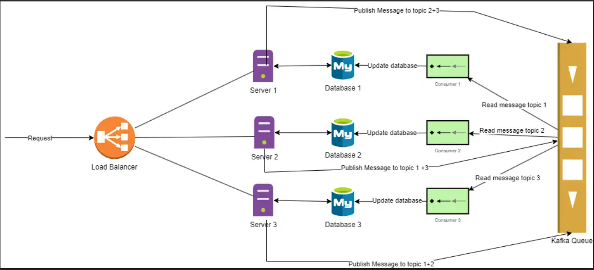
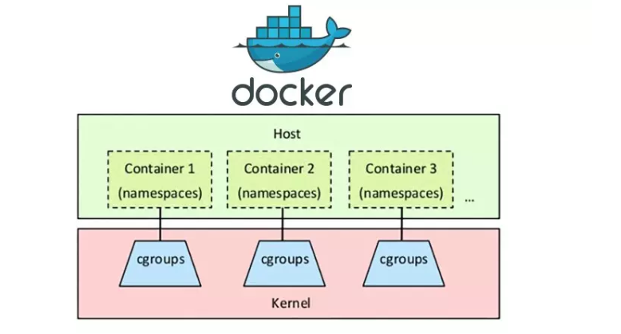
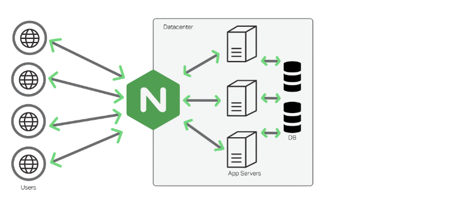

# Phát triển phần mềm hướng dịch vụ:
Chủ đề :  Tìm hiểu, cài đặt, tích hợp và đánh giá một số công cụ/công nghệ nâng cao trong phát triển phần mềm hướng dịch vụ

<table>
  <tr>
    <td style="text-align:center"><b>MSV</b></td>
    <td style="text-align:center"><b>Họ và tên</b></td>
  </tr>
  <tr style="text-align: center">
    <td>
       <b>B20DCCN700</b>
    </td>
   <td>
       <b>Vũ Quang Trung</b>
    </td>
  </tr>
    <tr style="text-align: center">
    <td>
       <b>B20DCCN366</b>
    </td>
   <td>
       <b>Nguyễn Quang Khải</b>
    </td>
  </tr>
    <tr style="text-align: center">
    <td>
       <b>B20DCCN534</b>
    </td>
   <td>
       <b>Nguyễn Ngọc Quang</b>
    </td>
  </tr>
</table>

# I) Các công nghệ/Công cụ tìm hiểu:
      - Containerization (Docker)
      - Message Brokers (Kafka)
      - Load Balancer (Nginx)
# II) Nội dung
week2:

week3:
1. Áp dụng và đánh giá các thuật toán Load Balance:

  Round robin:
  
. 17 request/s
+, response: 12ms
+, Receive kb: 24.81 
+, sent kb: 2.11 

.  330 request/s 
+, response: 27ms
+, receive kb: 449.37 kb
+, sent kb: 38.17 kb

. 550 request/s 
+, response: 166ms
+, receive kb: 784.79 kb
+, sent kb: 66.66 kb

Least connection:

. 17 request/s
+, response: 14ms
+, Receive kb: 23.28 kb
+, sent kb: 1.98 kb

.  330 request/s 
+, response: 50ms
+, receive kb: 441.82kb
+, sent kb: 37.53kb

. 550 request/s
+, response: 178ms
+, receive kb: 743.96kb
+, sent kb: 63.34kb

random:

. 17 request/s
+, average response time: 19ms
+, Receive kb: 24.61kb
+, sent kb: 2.09kb

.  330 request/s 
+, average response time: 47ms
+, receive kb: 447.82
+, sent kb: 37.53

. 550 request/s 
+, average response time: 211ms
+, receive kb: 782.14
+, sent kb: 66.43

Round robin weight (3-2-1):

. 17 request/s 
+, average response time: 21ms
+, Receive kb: 23.61
+, sent kb: 2.00

.  330 request/s
+, average response time: 67ms
+, receive kb: 425.95
+, sent kb: 36.18

. 550 request/s 
+, average response time: 201ms
+, receive kb: 764.59
+, sent kb: 63.56

hash request_id:

. 17 request/s 
+,average response time: 18ms
+, Receive kb: 22.85
+, sent kb: 1.94

.  330 request/s 
+, average response time: 61ms
+, receive kb: 444.55
+, sent kb: 37.76

. 550 request/s 
+, average response time: 181ms
+, receive kb :742.01
+, sent kb: 63.03

     
   

Kết luận: Vì là môi trường local, test nên không có sự ảnh hưởng của network, các server đều cấu hình giống hệt nhau và các request nội dung y hệt nhau. Vì vậy thuật toán round robin có response time nhanh hơn hẳn các thuật toán khác vì nó chia đều request cho các server, ngược lại thuật toán round robin với trọng số 3-2-1 lại là thuật toán có thời gian phản hồi chậm nhất (chỉ nhanh hơn random khi số lượng request đồng thời lớn) vì nó phân phối request không đều, các máy chủ có cấu hình y hệt nhau lại phải xử lý số lượng request khác biệt nhau rất nhiều dẫn đến 1 server đặt trọng số 3 (xử lý nhiều request nhất) xử lý mất thời gian hơn. 2 thuật toán Least Connection, Hash có response thấp hơn Weight Round Robin vì nhìn chung chúng cũng phân phối request đến các server 1 cách cân bằng, nhưng vì phải tính toán trung gian (như tính toán số lượng connection đến server, tính toán giá trị hash) nên có response chậm hơn Round Robin chỉ cần điều request đến các server theo cơ chế giống như 1 vòng tròn đơn giản mà không cần tính toán.

3. Giải pháp data replication:

   2.1 Sử dụng replication mặc định của databse:
   
   2.2 Sử dụng kafka để replicate:
   

Tham khao: https://engineering.tiki.vn/thiet-ke-he-thong-quan-ly-danh-muc-san-pham-trong-he-thong-ecommerce/ 

   Kết luận:
2 mô hình đều nhằm mục đích đồng bộ hóa database giữa master, slave giúp cho việc scale ngang hệ thống được thực hiện một cách dễ dàng, đảm bảo độ chính xác dữ liệu.

+, Điểm mạnh của mô hình 1:
Đảm bảo việc đồng bộ hóa giữa master và slave, khi logic replicate đằng sau đã được ẩn đi, ta không cần quan tâm quá trình mà chỉ cần quan tâm đến phần dựng cluster, sau đó không cần phải quan tâm đến lỗi vì phía mysql đã lo hết việc này.
Với mô hình 2, vì logic đồng bộ hóa do ta tự triển khai, vì vậy cần phải quan tâm việc nếu lỗi xảy ra thì nó nằm ở đâu, ở phần publisher, consumer, kafka,... Nhìn chung việc debug khi gặp lỗi rất khó khăn, ngoài ra cần có cơ chế retry khi không xử lý thành công việc update slave,... Ngoài ra mô hình 2 còn phải đảm bảo đúng thứ tự xử lý message để update slave đúng chuẩn theo master.

Nói tóm lại nếu sử dụng mô hình 1 thì sau khi dựng xong cụm master-slave thì không cần lo lắng quá nhiều => quản lý/giám sát/vận hành mô hình 1 đơn giản hơn mô hình 2 rất nhiều.

+, Điểm mạnh mô hình 2:
Khi mà phần đọc có thể sử dụng database riêng, ghi có thể sử dụng database riêng giúp tối ưu hóa việc đọc ghi => hiệu suất cải thiện đáng kể
Vì logic đồng bộ hóa do ta tự định nghĩa, nên phần master và slave có thể lưu data với cấu trúc khác hẳn nhau, không như mô hình 1 dữ liệu giống nhau hoàn toàn => linh động, xử lý được nhiều business logic phức tạp hơn
Thường được áp dụng khi áp dụng event sourcing pattern, khi cần lưu lại toàn bộ trạng thái của 1 đối tượng, thì việc stream bằng kafka và phần query sử dụng 1 database chuyên dành cho việc lưu trữ là hợp lý. Thường xuất hiện trong các bài toán như kiểm toán, tra cứu lịch sử thay đổi của tài khoản ngân hàng, theo dõi sự thay đổi của mặt hàng,...

Nói tóm lại mô hình 2 giúp nâng cao hiệu năng, xử lý được các bài toán, business logic đòi hỏi sự phức tạp hơn. 

### 1. Containerization (Docker)
Containerization là một phương pháp công nghệ cho phép đóng gói ứng dụng và tất cả các phụ thuộc của nó vào các container độc lập. Công nghệ containerization đã trở nên phổ biến và quan trọng trong phát triển phần mềm hiện đại vì khả năng tạo ra một môi trường cô lập và di động, giúp triển khai và vận hành các dịch vụ hướng dịch vụ (SOA - Service-Oriented Architecture) một cách linh hoạt và hiệu quả.
#### - Docker
Docker là một nền tảng containerization hàng đầu, cho phép các nhà phát triển đóng gói ứng dụng và các phụ thuộc của nó vào các container. Docker cung cấp một cách tiếp cận đơn giản và linh hoạt để xây dựng, vận chuyển và chạy các ứng dụng trong một môi trường cô lập.
Đóng gói ứng dụng: Tạo Docker image chứa ứng dụng và các phụ thuộc của nó.
Quản lý các container: Docker cho phép quản lý các container, bao gồm khởi chạy, dừng, xóa và tạo mới.
Kết hợp với các công cụ khác: Docker có thể kết hợp với các công cụ như Docker Compose để quản lý nhiều container cùng một lúc.

### 2. Message Brokers (Kafka): 
Message Brokers là một thành phần quan trọng trong việc xây dựng các hệ thống dịch vụ, cho phép các dịch vụ giao tiếp với nhau thông qua các thông điệp. Công nghệ như RabbitMQ và Apache Kafka cung cấp khả năng đảm bảo tính tin cậy, độ bền và khả năng mở rộng cho việc truyền tải và xử lý thông điệp. Message queue còn dùng để để hạn chế quá tải khi lượng truy cập tăng.

RabbitMQ có mô hình pub/sub đơn giản và phù hợp với các tác vụ xử lý lâu hoặc background jobs.

Kafka phức tạp hơn, to hơn phù hợp trong trường hợp cần xử lý high-throughput data streams.
rabbitmq sinh ra để làm queue chạy background job, rabbitmq không mạnh trong việc đảm bảo thứ tự của message
kafka sinh ra để stream, vì nó đảm bảo được thứ tự của các message

### 3. Load Balancer 
#### Trong một môi trường microservices, việc sử dụng load balancer là rất quan trọng để phân phối công việc và tăng tính khả dụng của hệ thống. Dưới đây là một số điểm quan trọng về load balancer trong microservices:
Phân phối tải (Load Distribution): Load balancer giúp phân phối tải vào các instance của các dịch vụ microservices. Điều này giúp đảm bảo rằng không có một instance nào quá tải trong khi các instance khác có sẵn tài nguyên không sử dụng.
Tăng tính khả dụng (High Availability): Bằng cách phân phối tải đồng đều và chuyển hướng yêu cầu đến các instance khác nhau, load balancer giúp tăng cường tính khả dụng của hệ thống. Nếu một instance gặp sự cố, load balancer có thể chuyển hướng lưu lượng đến các instance khác.
Tích hợp khả năng mở rộng: Load balancer thường hỗ trợ khả năng mở rộng nhanh chóng và linh hoạt. Khi số lượng instance tăng lên hoặc giảm đi, load balancer có thể tự động điều chỉnh để phản ánh sự thay đổi này.
Chuyển hướng yêu cầu dựa trên quy tắc: Load balancer có thể được cấu hình để chuyển hướng yêu cầu dựa trên các quy tắc nhất định, chẳng hạn như phân chia yêu cầu dựa trên phần trăm, điều hướng yêu cầu dựa trên địa chỉ IP nguồn, hoặc điều hướng yêu cầu dựa trên loại yêu cầu.
TLS Termination: Load balancer thường hỗ trợ chấm dứt TLS, giúp giảm bớt công việc xử lý mã hóa từ các service instances và tăng hiệu suất.
#### NGINX: Nginx là một lựa chọn phổ biến và mạnh mẽ cho việc triển khai cân bằng tải và proxy trong các ứng dụng web và microservices, nhờ vào hiệu suất cao, tính linh hoạt và khả năng mở rộng tốt.
Hiệu suất cao: Nginx được thiết kế để xử lý hàng ngàn kết nối đồng thời một cách hiệu quả, đặc biệt là trong môi trường có tải cao.
Cân bằng tải: Nginx cung cấp khả năng cân bằng tải giữa các máy chủ backend, phân phối công việc và người dùng một cách cân đối và hiệu quả.
Proxy ngược: Nginx có thể được sử dụng làm proxy ngược để bảo vệ các dịch vụ backend khỏi các cuộc tấn công trực tiếp từ internet và giúp ẩn đi cấu trúc backend.
Dễ dàng cấu hình: Nginx có cấu trúc cấu hình linh hoạt và dễ dàng để tùy chỉnh và cấu hình theo nhu cầu cụ thể của ứng dụng.
Hỗ trợ mở rộng và mô-đun: Nginx hỗ trợ cơ chế mở rộng bằng cách cho phép người dùng cài đặt các module mở rộng để mở rộng khả năng hoạt động của nó.
Giảm tải cho máy chủ backend: Bằng cách đóng vai trò làm cân bằng tải và cache, Nginx giảm tải cho các máy chủ backend, cải thiện hiệu suất và độ tin cậy của hệ thống.

